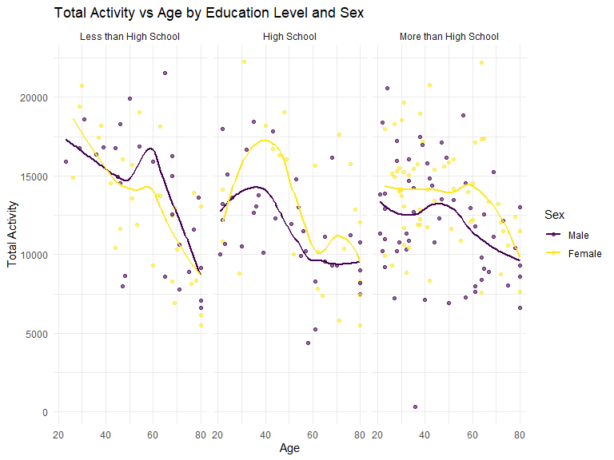
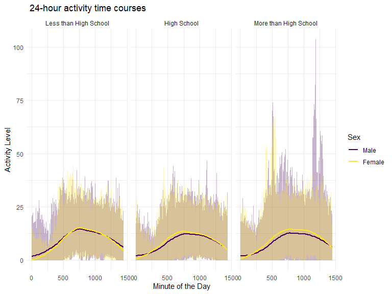

p8105_hw3_yl5829
================
2024-10-12

## Problem 1

``` r
#load the data
data("ny_noaa")

#data clean
ny_noaa_clean <- ny_noaa %>%
  separate(date, into = c("year", "month", "day"), convert = TRUE) %>%
  mutate(
    tmax = as.numeric(tmax),  
    tmin = as.numeric(tmin),
    snowfall = as.numeric(snow)
  ) %>%
  filter(!is.na(tmax) & !is.na(tmin))

#further cleaning
snowfall_count <- ny_noaa_clean %>%
  count(snowfall) %>%
  arrange(desc(n))

head(snowfall_count)
```

    ## # A tibble: 6 × 2
    ##   snowfall       n
    ##      <dbl>   <int>
    ## 1        0 1167149
    ## 2       NA  172332
    ## 3       25   17542
    ## 4       13   13704
    ## 5       51   10352
    ## 6        5    5960

By observing the result 0 is the most commonly for snowfall. It means
most of the time it does not snow at NY.

``` r
#further filter the data
ny_noaa_new <- ny_noaa_clean %>% 
  group_by(id, year, month) %>% 
  filter(month %in% c(1, 7)) %>% 
  summarize(mean_tmax = mean(tmax, na.rm = TRUE))  
```

    ## `summarise()` has grouped output by 'id', 'year'. You can override using the
    ## `.groups` argument.

``` r
#generate plot
ny_noaa_new %>%
  ggplot(aes(x = year, y = mean_tmax, group = id)) + 
  geom_line() +
  facet_grid(~month) +
  labs(title = "Mean Monthly Temperature for January and July",
       x = "Year", 
       y = "Mean Maximum Temperature (°C)")
```


Temperature is much lower for 1 compare to 7, and the variability of
temperature in 1 is higher than in 7. In 7 there is one outlier stand
out around 1986,7.

``` r
#plot
hex_plot <- ny_noaa_clean %>%
  ggplot(aes(x = tmin, y = tmax)) + 
  geom_hex() +
  labs(title = "Hexbin plot of tmax vs tmin")

ridge_plot <- ny_noaa_clean %>%
  filter(snowfall < 100, snowfall > 0) %>%
  ggplot(aes(x = snowfall, y = as.factor(year))) + 
  geom_density_ridges() +
  labs(title = "Snowfall Distribution by Year")

#combine plots
combined_plot <- hex_plot + ridge_plot
head(combined_plot)
```

    ## $data
    ## # A tibble: 101,096 × 10
    ##    id           year month   day  prcp  snow  snwd  tmax  tmin snowfall
    ##    <chr>       <int> <int> <int> <int> <int> <int> <dbl> <dbl>    <dbl>
    ##  1 USC00300023  1981     1    30    53    51    51   -56  -139       51
    ##  2 USC00300023  1982     2    19    30     3    51    33   -61        3
    ##  3 USC00300023  1982     3    11    33    51   102    56   -39       51
    ##  4 USC00300023  1982     3    13    25    25   127   106    -6       25
    ##  5 USC00300023  1982    12    20    NA    25    25    22   -33       25
    ##  6 USC00300023  1982    12    23    NA    38   102    17   -33       38
    ##  7 USC00300023  1983     1    14    NA    64    76    33   -22       64
    ##  8 USC00300023  1983     1    15    NA    76   152     0   -56       76
    ##  9 USC00300023  1983     2    24    NA    76    76    44   -33       76
    ## 10 USC00300023  1983     2    25    NA    13   102   -11   -94       13
    ## # ℹ 101,086 more rows
    ## 
    ## $layers
    ## $layers[[1]]
    ## geom_density_ridges: na.rm = FALSE, panel_scaling = TRUE
    ## stat_density_ridges: na.rm = FALSE
    ## position_points_sina

## Problem 2

``` r
demo <- read.csv("data/nhanes_covar.csv")
accel <- read.csv("data/nhanes_accel.csv")

#tidy demographic data by renaming columns
demo <- demo %>%
  rename(
    seqn = X,
    sex = X1...male,
    age = X.1,
    BMI = X.2,
    education = X1...Less.than.high.school 
  ) %>%
  mutate(
    sex = factor(sex, levels = c(1, 2), labels = c("Male", "Female")),
    education = factor(education, levels = c(1, 2, 3), labels = c("Less than High School", "High School", "More than High School"))
  )

accel <- accel %>% rename(seqn = SEQN)

# Merge two data
merged_data <- merge(demo, accel, by = "seqn")

merged_data <- merged_data %>% 
  mutate(age = as.numeric(age)) 

merged_data <- merged_data%>%
  filter(age >= 21) %>%
  filter(!is.na(sex) & !is.na(age) & !is.na(BMI) & !is.na(education)) 
```

``` r
#summary table for the number of men and women in each education category
education_sex_table <- merged_data %>%
  group_by(education, sex) %>%
  summarize(count = n()) %>%
  arrange(education, sex)
```

    ## `summarise()` has grouped output by 'education'. You can override using the
    ## `.groups` argument.

``` r
head(education_sex_table)
```

    ## # A tibble: 6 × 3
    ## # Groups:   education [3]
    ##   education             sex    count
    ##   <fct>                 <fct>  <int>
    ## 1 Less than High School Male      27
    ## 2 Less than High School Female    28
    ## 3 High School           Male      35
    ## 4 High School           Female    23
    ## 5 More than High School Male      56
    ## 6 More than High School Female    59

By looking at the table we can see that both male and female show higher
education level, and there is no large gap between education level of
male and female.

``` r
# Create a line plot for age distribution by education level and sex
ggplot(merged_data, aes(x = age, color = sex, group = sex)) +
  geom_density() +  # Line plot using density for smoother distribution
  facet_wrap(~ education) +
  labs(title = "Age Distribution by Education Level and Sex", 
       x = "Age", 
       y = "Density", 
       color = "Sex") +
  theme_minimal()
```


By looking at the plot we see that there are differences in the ages of
participants based on both education level and sex. Female tend to peak
at younger ages in each education category, while male age distributions
are generally broader.

``` r
#aggregate total activity
activity <- merged_data %>%
  rowwise() %>%
  mutate(total = sum(c_across(starts_with("min")), na.rm = TRUE)) %>%
  ungroup()

head(activity)
```

    ## # A tibble: 6 × 1,446
    ##   seqn  sex      age BMI   education  min1  min2  min3  min4   min5   min6  min7
    ##   <chr> <fct>  <dbl> <chr> <fct>     <dbl> <dbl> <dbl> <dbl>  <dbl>  <dbl> <dbl>
    ## 1 62161 Male      22 23.3  High Sch… 1.11  3.12  1.47  0.938 1.60   0.145  2.10 
    ## 2 62164 Female    44 23.2  More tha… 1.92  1.67  2.38  0.935 2.59   5.22   2.39 
    ## 3 62169 Male      21 20.1  High Sch… 5.85  5.18  4.76  6.48  6.85   7.24   6.12 
    ## 4 62174 Male      80 33.9  More tha… 5.42  3.48  3.72  3.81  6.85   4.45   0.561
    ## 5 62177 Male      51 20.1  High Sch… 6.14  8.06  9.99  6.60  4.57   2.78   7.10 
    ## 6 62178 Male      80 28.5  High Sch… 0.167 0.429 0.131 1.20  0.0796 0.0487 0.106
    ## # ℹ 1,434 more variables: min8 <dbl>, min9 <dbl>, min10 <dbl>, min11 <dbl>,
    ## #   min12 <dbl>, min13 <dbl>, min14 <dbl>, min15 <dbl>, min16 <dbl>,
    ## #   min17 <dbl>, min18 <dbl>, min19 <dbl>, min20 <dbl>, min21 <dbl>,
    ## #   min22 <dbl>, min23 <dbl>, min24 <dbl>, min25 <dbl>, min26 <dbl>,
    ## #   min27 <dbl>, min28 <dbl>, min29 <dbl>, min30 <dbl>, min31 <dbl>,
    ## #   min32 <dbl>, min33 <dbl>, min34 <dbl>, min35 <dbl>, min36 <dbl>,
    ## #   min37 <dbl>, min38 <dbl>, min39 <dbl>, min40 <dbl>, min41 <dbl>, …

``` r
#plot
ggplot(activity, aes(x = age, y = total, color = sex)) +
  geom_point(alpha = 0.6) +  
  geom_smooth(method = "loess", se = FALSE) +  
  facet_wrap(~ education) +  
  labs(title = "Total Activity vs Age by Education Level and Sex", 
       x = "Age", 
       y = "Total Activity", 
       color = "Sex") +
  theme_minimal()
```

    ## `geom_smooth()` using formula = 'y ~ x'



In education level equal or higher than high school, female shows more
activity levels than male. In Less than high school category, both male
and female shows a suddenly increase activity level around age 60.
However, overall both male and female illustrate a obviously decline
trend. This trend is also obvious for more than high school group. There
is a big upward trending from age 21 to age 40 for high school group,
which is significant different compare to any other groups.

``` r
#make the data from wide to long format for the minute columns
long_activity_data <- merged_data %>%
  pivot_longer(cols = starts_with("min"), names_to = "minute", values_to = "activity") %>%
  mutate(minute = as.numeric(gsub("min", "", minute)))

#plot
ggplot(long_activity_data, aes(x = minute, y = activity, color = sex)) +
  geom_line(alpha = 0.3) +  
  geom_smooth(se = FALSE, method = "loess") +  
  facet_wrap(~ education) +
  labs(title = " 24-hour activity time courses", 
       x = "Minute of the Day", 
       y = "Activity Level", 
       color = "Sex") +
  theme_minimal()
```

    ## `geom_smooth()` using formula = 'y ~ x'



By observing the plot we see that activity generally increases in the
morning, reach its peaks around midday, and declines in the evening
across all education levels. People has “More than High School”
education shows higher and more sustained activity throughout the day
compared to the other groups. For all education groups, Females
consistently show slightly higher activity levels than males,
particularly in the middle of the day. In the “Less than High School”
group, activity is generally lower, while those in the “High School” and
“More than High School” groups maintain more structured and consistent
activity patterns. Overall, both education and sex influence the
intensity and distribution of physical activity throughout the day.

## Problem3

``` r
july24 <- read.csv("data/July 2024 Citi.csv") %>%
  mutate(year = 2024, month = "July")
jan24 <- read.csv("data/Jan 2024 Citi.csv") %>%
  mutate(year = 2024, month = "January")
july20 <- read.csv("data/July 2020 Citi.csv") %>%
  mutate(year = 2020, month = "July")
jan20 <- read.csv("data/Jan 2020 Citi.csv") %>%
  mutate(year = 2020, month = "January")

#combine all datasets
citi <- bind_rows(july24, jan24, july20, jan20)

#clean the combined data
citi <- citi %>%
  drop_na() %>%
  mutate(
    weekdays = factor(weekdays, levels = c("Monday", "Tuesday", "Wednesday", "Thursday", "Friday", "Saturday", "Sunday")),
    duration = as.numeric(duration), 
    member_casual = as.factor(member_casual),
    rideable_type = as.factor(rideable_type)
  )

head(citi)
```

    ##            ride_id rideable_type  weekdays  duration      start_station_name
    ## 1 86AE148E36FBF035  classic_bike    Sunday 19.661183            Picnic Point
    ## 2 FCF07A30F66B9B07 electric_bike  Thursday  7.676433         W 54 St & 9 Ave
    ## 3 D8397E843C06644D  classic_bike  Thursday 24.465950        12 Ave & W 40 St
    ## 4 E575690C13424E8C electric_bike   Tuesday  3.528600 Grand St & Havemeyer St
    ## 5 184AABED46DCE11A electric_bike Wednesday 24.126050     Broadway & Kent Ave
    ## 6 ACA61A92B5EA0D11  classic_bike  Saturday  7.825750          E 1 St & 1 Ave
    ##          end_station_name member_casual year month
    ## 1   Yankee Ferry Terminal        casual 2024  July
    ## 2         W 42 St & 8 Ave        casual 2024  July
    ## 3 W 84 St & Amsterdam Ave        member 2024  July
    ## 4      S 4 St & Rodney St        member 2024  July
    ## 5    Henry St & Degraw St        casual 2024  July
    ## 6   Mercer St & Spring St        member 2024  July

The dataset contains around 99253 rows, each representing a ride on the
Citi Bike system. Each row has information on the ride type (electric or
classic bike), the weekdays the ride was taken, the duration (in
minutes), the start station name, the end station name, and whether the
rider was a member or a casual rider.

``` r
#make a table of total rides by year, month, and membership status
summary <- citi %>%
  group_by(year, month, member_casual) %>%
  summarize(total_rides = n(), .groups = 'drop') %>%
  arrange(year, month, member_casual)

head(summary)
```

    ## # A tibble: 6 × 4
    ##    year month   member_casual total_rides
    ##   <dbl> <chr>   <fct>               <int>
    ## 1  2020 January casual                980
    ## 2  2020 January member              11418
    ## 3  2020 July    casual               5625
    ## 4  2020 July    member              15388
    ## 5  2024 January casual               2094
    ## 6  2024 January member              16705

Based on the table we can see that July has significantly more rides
than January in both 2020 and 2024. Meaning more people want to ride
during warmer season instead of cold season. We can see that there are
much more member than casual riders in both month (Jan and July) and
year (2020 and 2024). It looks like the useage of citi bike increase by
years.

``` r
#filter for July 2024 and summarize the top 5 starting stations
stations <- citi %>%
  filter(year == 2024, month == "July") %>%
  group_by(start_station_name) %>%
  summarize(total_rides = n(), .groups = 'drop') %>%
  arrange(desc(total_rides)) %>%
  head(5)

stations
```

    ## # A tibble: 5 × 2
    ##   start_station_name       total_rides
    ##   <chr>                          <int>
    ## 1 Pier 61 at Chelsea Piers         163
    ## 2 University Pl & E 14 St          155
    ## 3 W 21 St & 6 Ave                  152
    ## 4 West St & Chambers St            150
    ## 5 W 31 St & 7 Ave                  145

``` r
#compute the median ride duration
duration <- citi %>%
  group_by(year, month, weekdays) %>%
  summarize(median_duration = median(duration, na.rm = TRUE), .groups = 'drop')

#produce plot
ggplot(citi, aes(x = weekdays, y = duration, fill = member_casual)) +
  geom_boxplot() +
  facet_grid(year ~ month) +
  labs(title = "Ride Duration by Day of Week, Month, and Year",
       x = "Day of Week",
       y = "Ride Duration (mins)",
       fill = "Membership Status") +
  theme_minimal()
```


The duration tend to be longer on weekends and members generally have
shorter and more consistent ride durations throughout the week. July has
longer ride duration compared to January across both years, a guess
might be that people like to ride during warm day more. Ride during 2024
show more variability compare to 2020 and also be more longer than in
2020.

``` r
#filter data for 2024 and produce plot
distribution <- citi %>%
  filter(year == 2024) %>%
  ggplot(aes(x = duration, fill = member_casual)) +
  geom_density(alpha = 0.6) +
  facet_grid(rideable_type ~ month) +
  labs(title = "Ride Duration Distribution in 2024 by Month, Membership, and Bike Type",
       x = "Ride Duration (mins)",
       y = "Density",
       fill = "Membership Status") +
  theme_minimal()
distribution
```


By observing the plot, both classic and electric bikes is heavily
right-skewed, meaning the majority of rides are relatively short, with
ride duration concentrated under 30 minutes. However, electric bikes
tend to have slightly shorter rides on average. The casual rider tend to
have slightly longer rides compare to members. While member has shorter
but more consistent ride duration. July has slightly broader
distribution of duration compare to January, especially for casual
riders.
